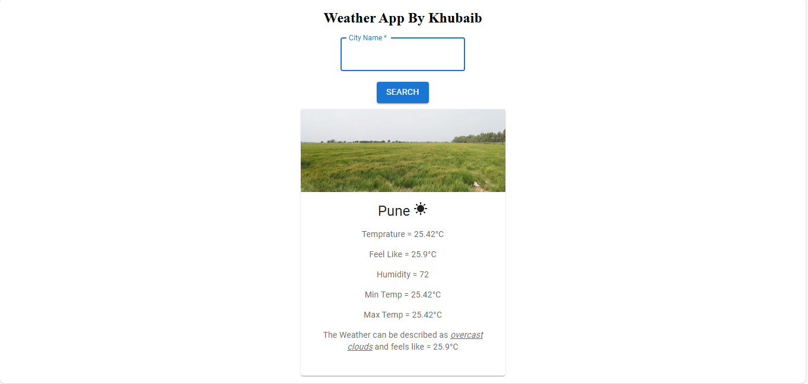

# 🌦️ Weather Widget App

A simple and responsive weather widget built with **React** that fetches real-time weather data using the **OpenWeatherMap API**.

---

## 📸 Preview



---

## 🚀 Features

- 🌍 Get live weather data for any city  
- 🌡 Displays temperature, humidity, wind speed, and weather description  
- 🏙️ Change city using input  
- ⚡ Built with React and Axios

---

## 🛠 Tech Stack

- **React** (Frontend)  
- **Axios** (for API calls)  
- **Tailwind CSS** (optional, for styling)  
- **OpenWeatherMap API**

---

## 🔧 Installation & Setup

```bash
# 1. Clone the repository
git clone https://github.com/your-username/weather-widget-app.git

# 2. Go to the project directory
cd weather-widget-app

# 3. Install dependencies
npm install

# 4. Start the development server
npm start
```

---

## 🔑 API Setup

1. Go to [OpenWeatherMap](https://openweathermap.org/)
2. Create an account and generate an API key
3. In the root directory of your project, create a `.env` file
4. Add the following:

```env
REACT_APP_API_KEY=your_openweathermap_api_key
```

5. Use the API key in your React code like this:

```js
const API_KEY = process.env.REACT_APP_API_KEY;
```

---

## 🧪 Project Structure

```
weather-widget-app/
├── public/
├── src/
│   ├── components/
│   │   └── WeatherWidget.jsx
│   ├── App.jsx
│   └── index.js
├── .env
├── README.md
└── package.json
```

---

## 📦 Deployment

You can deploy this app using:

- Vercel  
- Netlify  
- GitHub Pages

---

## 🙋‍♂️ Author

**Mohd Khubaib**  
Bachelor of Computer Applications (BCA) — Software Engineering  
📧 mkhubaib543@gmail.com 
🔗 [LinkedIn]( https://www.linkedin.com/in/mohd-khubaib/) | [GitHub ](https://github.com/Mohdkhubaib01)

---

## 📜 License

This project is licensed under the MIT License.
